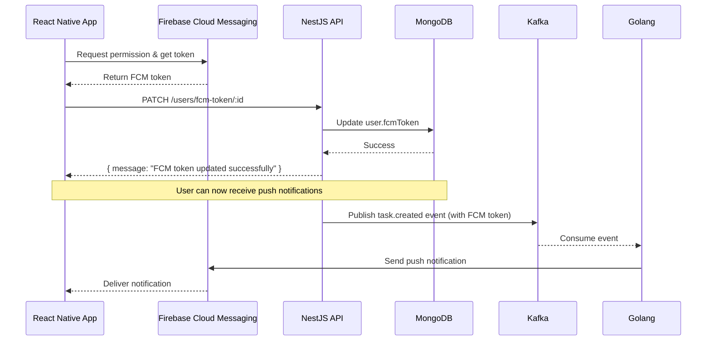

# FCM Token Update Endpoint

## Endpoint

**PATCH** `/api/v1/users/fcm-token/:id`

Updates the FCM (Firebase Cloud Messaging) token for a user. This endpoint should be called from the React Native mobile app after:
- User logs in
- FCM token is refreshed

## Authentication

Requires authentication via JWT token in the Authorization header.

## Request

### URL Parameters

| Parameter | Type   | Description               |
|-----------|--------|---------------------------|
| id        | string | MongoDB ObjectId of user  |

### Request Body

```json
{
  "fcmToken": "device-fcm-token-string-here"
}
```

### Example Request

```bash
curl -X PATCH http://localhost:3000/api/v1/users/fcm-token/507f191e810c19729de860ea \
  -H "Content-Type: application/json" \
  -H "Authorization: Bearer YOUR_JWT_TOKEN" \
  -d '{
    "fcmToken": "fMZL9xGzTUqK8vF5nQ2pXY:APA91bH..."
  }'
```

## Response

### Success (200 OK)

```json
{
  "statusCode": 200,
  "message": "FCM token updated successfully",
  "data": {
    "message": "FCM token updated successfully",
    "userId": "507f191e810c19729de860ea"
  }
}
```

### Error Responses

**400 Bad Request** - Invalid user ID or user not found

```json
{
  "statusCode": 400,
  "message": "Invalid user ID",
  "error": "Bad Request"
}
```

**401 Unauthorized** - Missing or invalid JWT token

```json
{
  "statusCode": 401,
  "message": "Unauthorized"
}
```

## React Native Integration

### Using Axios

```typescript
import api from './api'; // Your configured axios instance
import { getFCMToken } from './notificationService';

const updateFcmToken = async (userId: string) => {
  try {
    const fcmToken = await getFCMToken();
    
    if (fcmToken) {
      const response = await api.patch(`/users/fcm-token/${userId}`, {
        fcmToken: fcmToken,
      });
      
      console.log('FCM token updated:', response.data);
      return response.data;
    }
  } catch (error) {
    console.error('Error updating FCM token:', error);
    throw error;
  }
};

// Call after login
await updateFcmToken(user.id);
```

### Using Fetch

```typescript
const updateFcmToken = async (userId: string, fcmToken: string, authToken: string) => {
  const response = await fetch(`https://your-api.com/api/v1/users/fcm-token/${userId}`, {
    method: 'PATCH',
    headers: {
      'Content-Type': 'application/json',
      'Authorization': `Bearer ${authToken}`,
    },
    body: JSON.stringify({ fcmToken }),
  });

  if (!response.ok) {
    throw new Error('Failed to update FCM token');
  }

  return await response.json();
};
```

## Implementation Flow



## Notes

- Users must be authenticated to update their FCM token
- The FCM token is stored in the `fcmToken` field of the user document
- This token is used when publishing `task.created` events to Kafka
- The Golang notification service uses this token to send FCM push notifications
- FCM tokens can expire or change, so the mobile app should listen for token refresh events and update accordingly
